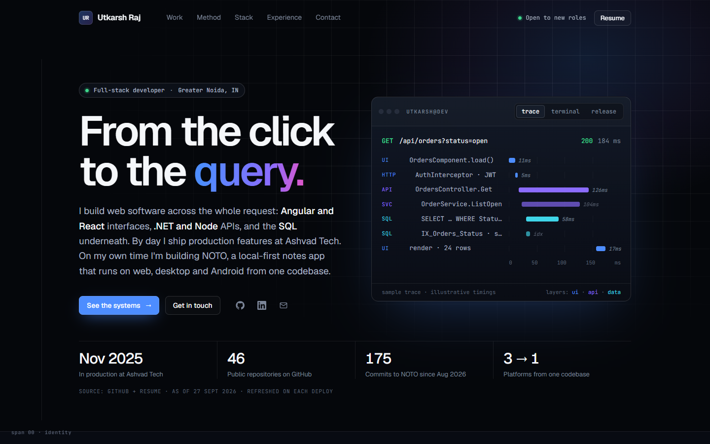

<h2 align="center">
  Portfolio Website - v3.0 
  <a href="https://utkarsh-raz032.netlify.app/" target="_blank">utkarsh-raz032</a>
</h2>

  

 

## Stack

React 18 + Vite 5 + React Router. Plain CSS with design tokens (`src/styles/base.css`), no UI framework.
Fonts are self-hosted (Geist, JetBrains Mono).

## Scripts

| Command                  | What it does                                             |
| ------------------------ | -------------------------------------------------------- |
| `npm run dev`            | Dev server                                               |
| `npm run build`          | Refreshes GitHub stats, then builds to `dist/`           |
| `npm run github:refresh` | Refreshes `src/data/github.json` from the GitHub API     |
| `npm run lint`           | ESLint                                                   |

## Editing content

All content lives in `src/data/`. Components render whatever is there.

| File              | Content                                                             |
| ----------------- | ------------------------------------------------------------------- |
| `profile.js`      | Name, links, email, availability, nav sections                      |
| `projects.js`     | Featured project (NOTO), system cards, other builds                 |
| `caseStudies.js`  | Long-form case studies at `/work/:slug`                             |
| `stack.js`        | Tools by layer, and where each was used                             |
| `experience.js`   | Roles, education, certifications, "How I work" steps                |
| `github.json`     | Generated before each build. Don't edit by hand.                    |

Case-study fields set to `null` render as a visible **TODO**. Fill them with real, measured
information only.

## Deploy

Netlify. `public/_redirects` sends every route to `index.html` so `/work/:slug` works on refresh.
